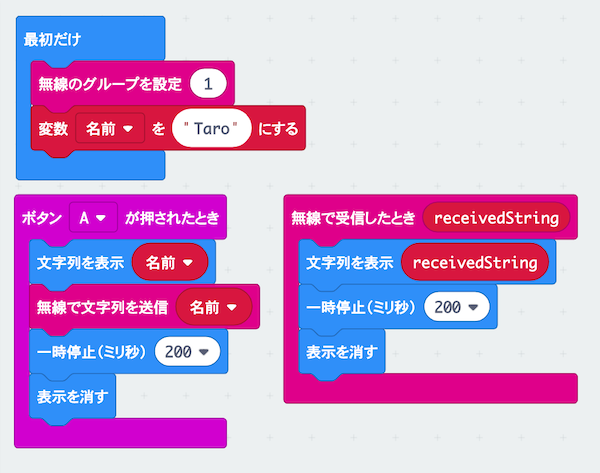

# ひみつの通信機を作ろう

## むずかしさ　★★★☆☆

## 使うもの
1. マイクロビット本体（2台以上で通信します）
2. 電池ボックス

## プログラム

プロジェクト： https://makecode.microbit.org/_DguRwWHPUVaC

## 作り方

1. 変数`名前`を作ります  
2. 変数`名前`を `" "` にするブロックの文字列は、文字列ブロックの一番上のブロックを使います
  
3. `文字列を表示`ブロックの変数  `receivedString`は、`無線で受信したとき`ブロックからコピー（変数をタップして移動）します
  
4. プログラムをマイクロビットに書きこみます  
5. 電池ボックスをつなぎます  

## 使い方

* Aボタンをおすと、名前が画面にでます  
* 名前は他の人のマイクロビットにも送られます  
* どこまではなれて通信できるか試してみよう  
