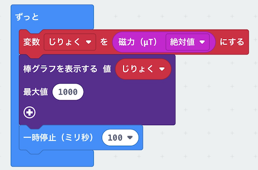

# じしゃくの力をはかろう

## むずかしさ　★☆☆☆☆

## 使うもの
1. マイクロビット本体

## プログラム

プロジェクト： https://makecode.microbit.org/_YWYLyThhL6Ta

## 作り方

1. <ruby>変数<rp>(</rp><rt>へんすう</rt><rp>)</rp></ruby>`じりょく`を作ります
2. <ruby>`棒`<rp>(</rp><rt>`ぼう`</rt><rp>)</rp></ruby>`グラフを`<ruby>`表示`<rp>(</rp><rt>`ひょうじ`</rt><rp>)</rp></ruby>`する`のブロックは、`LED`メニューにあります
3. プログラムをマイクロビットに書きこみます

## 使い方

* <ruby>最初<rp>(</rp><rt>さいしょ</rt><rp>)</rp></ruby>に動かすと`TILT TO FILL SCREEN`と出るので、かたむけてLEDで<ruby>画面<rp>(</rp><rt>がめん</rt><rp>)</rp></ruby>をぬりつぶそう
* マイクロビットのじしゃくのセンサ（<ruby>電子<rp>(</rp><rt>でんし</rt><rp>)</rp></ruby>コンパス）はうら側にあります
* マイクロビットのうら<ruby>側<rp>(</rp><rt>がわ</rt><rp>)</rp></ruby>を色んなところにかざしてみましょう（パソコンとかスマホとか）
