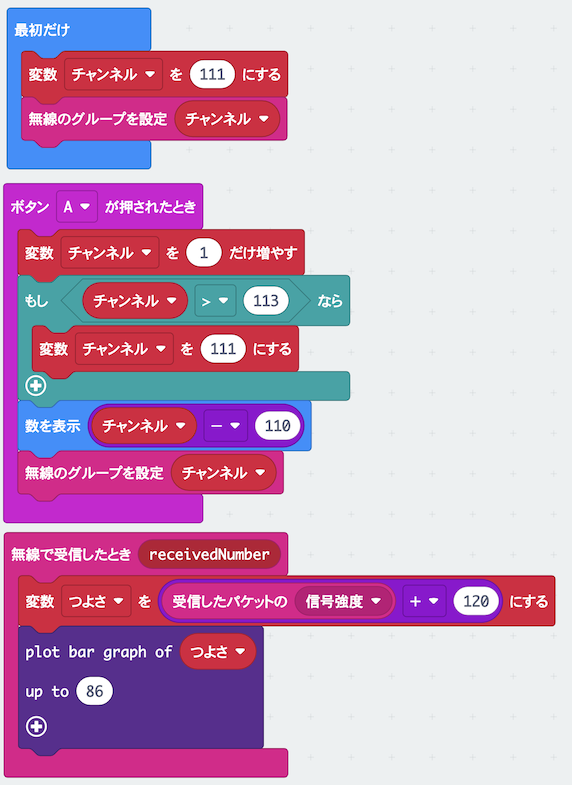

# たからさがしゲームで<ruby>遊<rp>(</rp><rt>あそ</rt><rp>)</rp></ruby>ぼう

## むずかしさ　★★★☆☆

## 使うもの
1. マイクロビット本体
2. <ruby>電池<rp>(</rp><rt>でんち</rt><rp>)</rp></ruby>ボックス

## プログラム

プロジェクト： https://makecode.microbit.org/_7jaDmW7juCAJ

## 作り方

1. <ruby>変数<rp>(</rp><rt>へんすう</rt><rp>)</rp></ruby>`チャンネル`と`つよさ`を作ります
2. <ruby>`棒`<rp>(</rp><rt>`ぼう`</rt><rp>)</rp></ruby>`グラフを`<ruby>`表示`<rp>(</rp><rt>`ひょうじ`</rt><rp>)</rp></ruby>`する`のブロックは、`LED`メニューにあります
3. プログラムをマイクロビットに書きこみます
4. <ruby>電池<rp>(</rp><rt>でんち</rt><rp>)</rp></ruby>ボックスをつなぎます

## 使い方

* ワークショップ会場にかくされた三つの<ruby>宝<rp>(</rp><rt>たから</rt><rp>)</rp></ruby>もの（<ruby>送信機<rp>(</rp><rt>そうしんき</rt><rp>)</rp></ruby>）をさがしましょう
* <ruby>送信機<rp>(</rp><rt>そうしんき</rt><rp>)</rp></ruby>に近づくと`つよさ`が大きくなって、<ruby>画面<rp>(</rp><rt>がめん</rt><rp>)</rp></ruby>が光ります
* <ruby>画面<rp>(</rp><rt>がめん</rt><rp>)</rp></ruby>が全部光るところに近づこう
* 三つの<ruby>送信機<rp>(</rp><rt>そうしんき</rt><rp>)</rp></ruby>の<ruby>無線<rp>(</rp><rt>むせん</rt><rp>)</rp></ruby>グループは、それぞれ1〜3になっています
* Aボタンをおすと、<ruby>無線<rp>(</rp><rt>むせん</rt><rp>)</rp></ruby>のグループが１〜3に切りかわります

## ヒント

* <ruby>送信機<rp>(</rp><rt>そうしんき</rt><rp>)</rp></ruby>は2秒ごとに<ruby>信号<rp>(</rp><rt>しんごう</rt><rp>)</rp></ruby>を出します（ゆっくり歩いてさがしましょう）
* <ruby>送信機<rp>(</rp><rt>そうしんき</rt><rp>)</rp></ruby>は見えるところにあります（<ruby>冷蔵庫<rp>(</rp><rt>れいぞうこ</rt><rp>)</rp></ruby>の中にはありません）
* Bボタンを押すと<ruby>送信機<rp>(</rp><rt>そうしんき</rt><rp>)</rp></ruby>から音が出ます。近づくと音が大きくなります。

